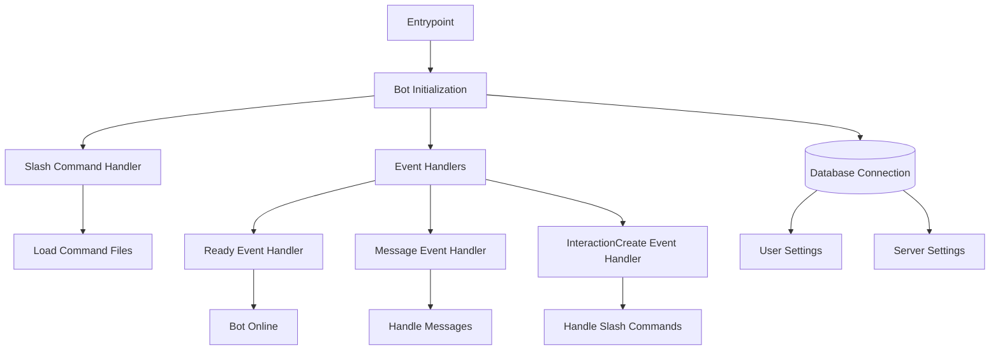

# alioth
multi purpose search engine inside of discord. continuation of altair

## goals
- being able to request data from a multitude of different sources (images, media, knowledge, news?)
- displaying them consistently within discord (embeds)
- database integration for user and server settings (preferences, visibility)
- flexible command handler

## structure

